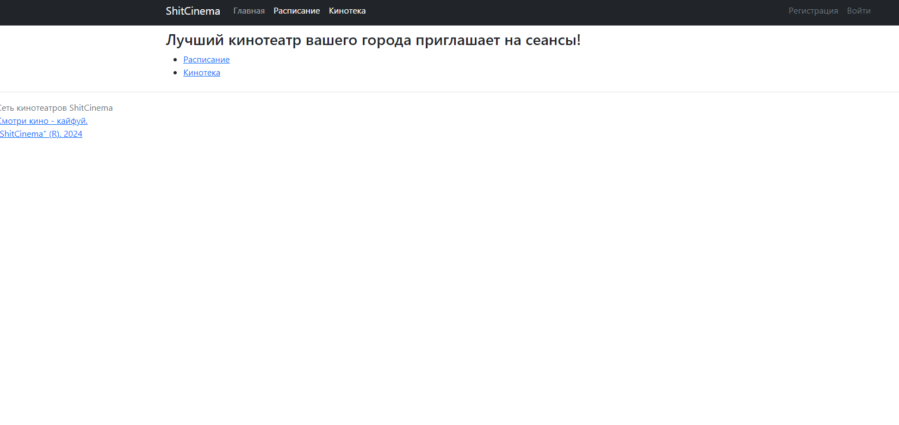
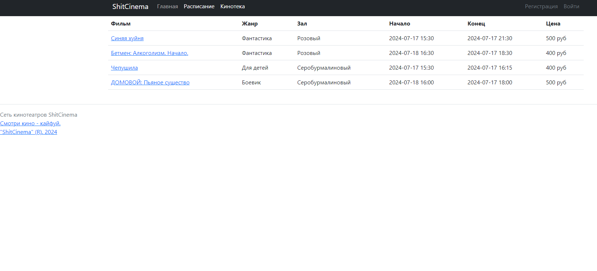
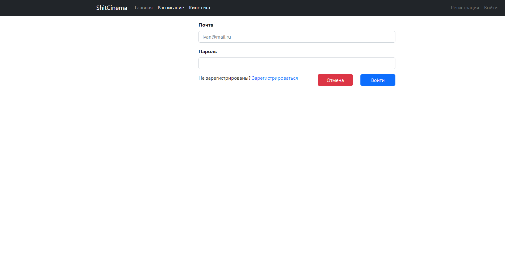

Проект "кинотеатр" по курсу Java Middle от job4j.ru
Имитирует работу веб-сервиса кинотеатра, для покупки билетов на различные сеансы.

Реалзиованый функционал:
-Регистрацию/Вход пользоваталей;
-Расписание киносеансов;
-Кинотека - информация по фильмам.
-Покупка билетов для авторизированных пользоваталей.

Стек технологий: Spring Boot, Thymeleaf, Bootstrap, Liquibase, Sql2o, PostgreSQL

Требования к окружению: Java 17, Maven 3.8 и выше, PostgreSQL начиная с 16 версии.

Запуск проекта:

1. create database cinema;
2. указать конфигурацию в src/main/resources/application.properties
3. запустить src/main/java/ru/job4j/cinema/Job4jCinemaApplication.java

Выполнил Кучеров Филипп  https://github.com/grave42